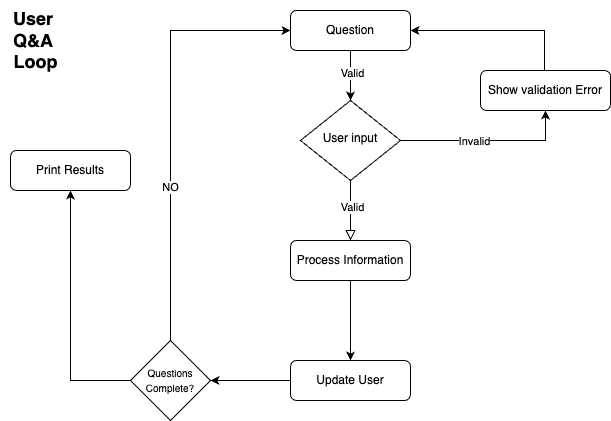

# Scala CLI Application

## Table of Contents
- [Introduction](#introduction)
- [Features](#features)
- [System Diagram](#system-diagram)
- [Getting Started](#getting-started)
- [Usage](#usage)
- [Contributing](#contributing)
- [License](#license)

---

## Introduction
This is a simple Scala CLI application built using SBT. The application interacts with users through a Question & Answer (Q&A) interface to gather information and display interesting, personalized results. Designed for ease of use and minimal setup, this project is a fun and lightweight tool to showcase Scala in a command-line environment.

## Features
- Interactive Q&A session to collect user information.
- Displays personalized, insightful results.
- Easy to set up and run using SBT.

## System Diagram
Below is the system diagram for the application:



## Getting Started

### Prerequisites
To run this application, ensure you have the following installed:
- **Java JDK 8 or higher**
- **Scala 2.x**
- **SBT (Scala Build Tool)**

### Installation
1. Clone this repository:
   ```bash
   git clone <repository-url>
